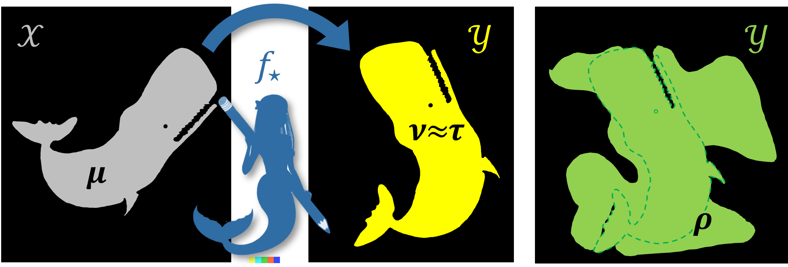

# A Theory of Unsupervised Translation Motivated by Understanding Animal Communication


Code for running the experiments accompanying _[A Theory of Unsupervised Translation Motivated by Understanding Animal Communication](https://arxiv.org/abs/2211.11081)_ (NeurIPS 2023).

## Setup
1`git clone https://github.com/orrp/theory-of-umt.git`
2Recommended: [Create a new conda environment and activate it](https://conda.io/docs/test-drive.html).
Tested with Python 3.11.
3. `cd theory-of-umt`
4. `pip install -e .`
5. `wandb login` (create an account first, if necessary).

## Launching an experiment
To allow for simple multiprocessing (even across multiple machines), we use
[wandb sweeps](https://docs.wandb.ai/guides/sweeps). Each experiment has a corresponding
sweep name:

| Fig. in paper | Sweep name    |
|---------------|---------------|
| 4             | `kg_alpha`    |
| 5             | `cn_alpha`    |
| 6             | `kg_n_source` |

To reproduce the figures, first launch a sweep:
```
wandb sweep sweeps/sweep_name.yaml
```
This command outputs
1. A URL for viewing the sweep: `https://wandb.ai/...`
2. A command for running sweep agents: `wandb agent ...`

You can run the experiment with `wandb agent ...`.
For multiprocessing, run this command multiple times (one for each process).
You can even run the command from different machines, as long as they have this
repository installed.

Once the sweep is finished, view it by following the above URL. The graph depicted
there should match the one in the paper (up to axis/legend names and colors).

## Citation
```
@inproceedings{GoldwasserGKP23,
  author       = {Shafi Goldwasser and
                  David G. Gruber and
                  Adam Tauman Kalai and
                  Orr Paradise},
  title        = {A Theory of Unsupervised Translation Motivated by Understanding Animal
                  Communication},
  booktitle    = {NeurIPS},
  year         = {2023},
}
```